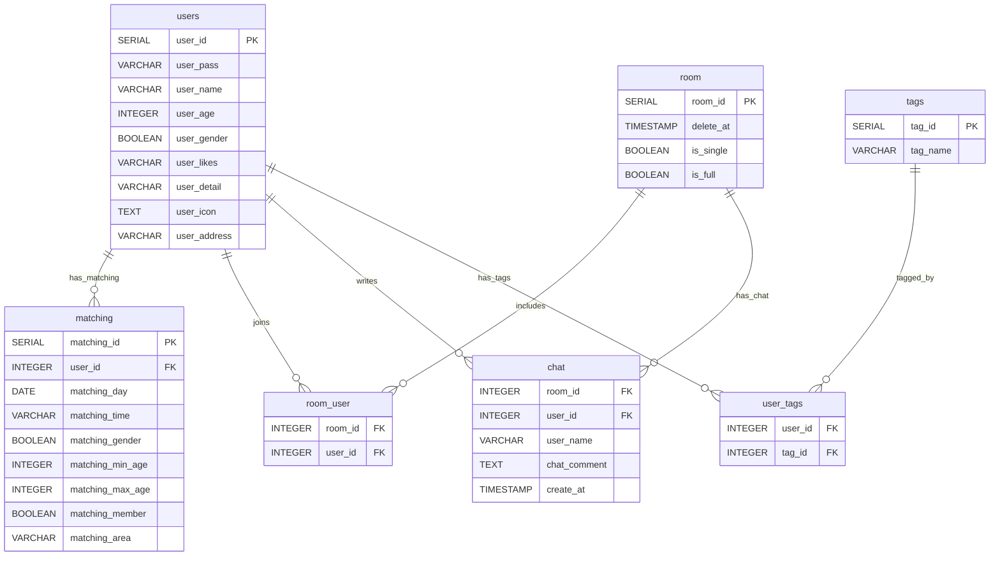

https://qiita.com/r_midori/items/2c4feb5de05535441bc8
↑↑↑↑↑↑↑↑↑↑
これ参考に画像URL貼ってください

サイト概要画像URL

# Meat up! 要件定義書

## 🎯 概要
本サービスは、
「一人焼肉に抵抗がある人向けに、一緒に焼肉を楽しむ仲間を探すため、日時・場所・条件で相手をマッチングするアプリ」です。
ユーザー登録後にプロフィールと希望条件を設定し、他ユーザーとのマッチングを行うWebアプリケーションです。マッチングが成立したユーザー同士は、チャット画面でメッセージのやり取りが可能です。

---

## 🧩 使用技術
- **プログラミング言語**: Java 21
- **バックエンド**: Spring Boot, Spring Security, MyBatis
- **テンプレートエンジン**: Thymeleaf
- **データベース**: PostgreSQL
- **認証方式**: ローカル認証（ユーザーネーム / パスワード）
- **フロントエンド**: HTML, CSS（Thymeleaf経由）
- **ビルド/管理**: Gradle

---

## 📝 ユースケース

### 1. アカウント登録・ログイン
- ユーザーはログインID、パスワード、プロフィール情報を登録
- 登録後、ログイン可能
- パスワードはBCryptでハッシュ化して保存

### 2. プロフィール設定・編集
- 名前、性別、年齢、好きな部位などを登録・編集可能

### 3. マッチング条件の設定
- 希望する相手の性別、年齢範囲、希望場所、希望日時を条件として登録

### 4. マッチング処理
- 希望条件登録済みの他ユーザーの情報とマッチング条件を比較し、マッチング結果を表示
- 最大３件のマッチ候補からの選択で遷移先が異なる

### 5. チャット機能
- マッチ成立した相手たちとチャット画面でやり取り可能
- メッセージ送信時にページ再読み込みまたは更新ボタンで手動読み込み

---

## 🗃 データベース設計（主なテーブル）

| テーブル名 | 概要 |
|------------|------|
| `users` | ユーザーの基本情報 |
| `matching` | マッチングの希望条件 |
| `room` | チャットルーム情報 |
| `room_user` | ルームとユーザーの中間テーブル |
| `chat` | チャット履歴 |
| `tags` | ユーザータグ管理 |
| `user_tags` | ユーザーとタグの中間テーブル |

---

## 📁 画面構成

| 画面名 | URL例 |機能 |
|------------|------|------------|
|タイトルページ| /|サービス説明|
|ログインページ| /login|ユーザーログイン|
|アカウント登録ページ| /register|ユーザー情報登録|
|ホーム画面| /home|マッチング情報確認＆マッチング条件設定|
|マイページ画面| /mypage|プロフィール確認、ログアウト|
|プロフィール編集画面| /edit|ユーザープロフィールの変更|
|マッチング待機画面| /notfound|5秒ごとに自動更新|
|マッチング選択画面| /select|マッチング候補選択|
|チャット画面| /chatroom|ユーザー同士のチャット|

---

## 🔐 認証・セキュリティ

- Spring Securityを使用したフィルターチェーンによるセキュリティ管理
- パスワードはBCryptでハッシュ化
- ログイン成功時にホーム画面へ遷移
- 認証されていないユーザーはログインページにリダイレクト

---

## ⚙️ 非機能要件

- データは1日1回バックアップ（手動/自動は問わない）

## ER図

## ＵＩフロー図
UIフロー図画像URL

## ワイヤーフレーム
ワイヤーフレーム画像URL
